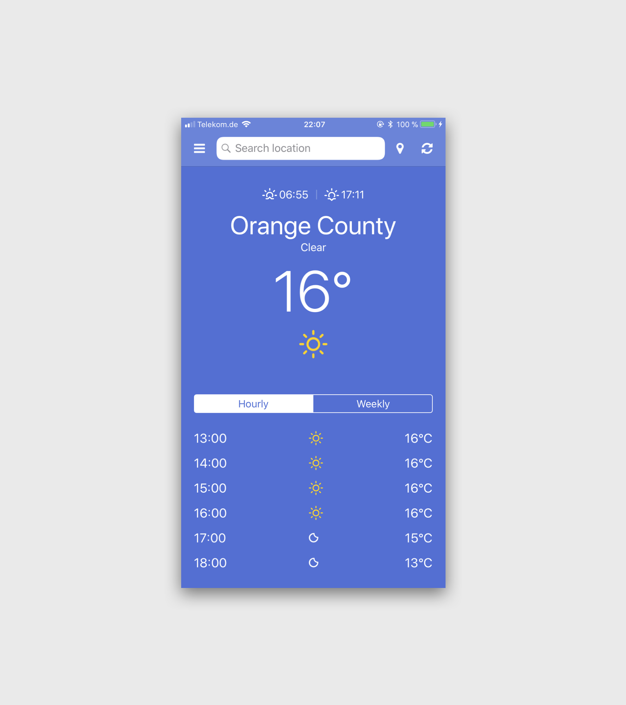

# NativeScript Weather App. Based on Angular.

---

## What it is
I was working with NativeScript the last few weeks and finally decided to create a small app using a online weather service.


### Features
* Search a location
* Weather for your current location
* Hourly and weekly forecast
* Weather layouts with colors
* Your last search results
* RadSideDrawer integration

## Screenshot



## Setup
This app is developed with NativeScript/Angular for iOS. All code and interfaces are created by myself.


## Install

```npm install```


## Run

```tns run ios```
